

# Abaqus:  A Short Course for Engineers

## Contents
- [Exercise 1.1:  Beam with Area Loading](#ex-1)
    - [Module *Part*](#ex1-parts)
    - [Module *Property*](#ex1-property)
    - [Module *Assembly*](#ex1-assembly)
    - [Module *Step*](#ex1-step)
    - [Module *Load*](#ex1-load)
    - [Module *Mesh*](#ex1-mesh)
    - [Module *Job*](#ex1-job)
    - [Module *Visualization*](#ex1-vis)
- [Exercise 1.2:  Postprocessing & Visualization](#ex-2)
    - [View Manipulation & Options](#ex-2-viewmanip)
    - [Render Style](#ex-2-render)
    - [Display Group](#ex-2-display)
    - [Field Output Visualization](#ex-2-field)
- [Credits](#credits)

## 1. Introduction & Workflow
##### March 31, 2015 • Computational Science and Engineering

---

## Exercise 1.1:  Beam with Area Loading

Consider a steel beam of dimensions $L \times W \times H = 200\,\textrm{cm} \times 20\,\textrm{cm} \times 20\,\textrm{cm}$.  Calculate the deformation resulting from a continuous loading of $F = 200 \,\textrm{Pa}$.

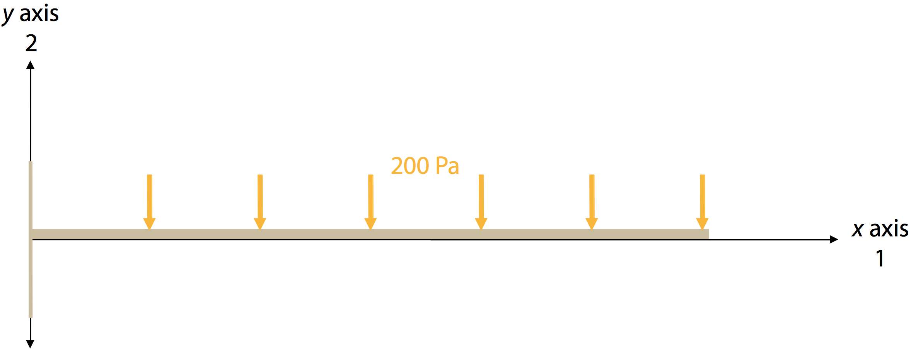

### Module *Part*

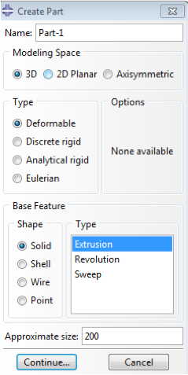
1. Click the *Create Part* icon  in the `Toolbox area`. The *Create Part* dialog box appears. 
    1. Name the part `Beam`  and select a `3D`, `Deformable` body with a `solid`, `Extrusion` base feature.
    2. For `Approximate size`, type `200`.

2. Click `Continue` to exit the *Create Part* dialog box. Now Abaqus/CAE automatically enters `Sketch`.
    1. Select the *Create Lines: Rectangle* tool  located in the upper-right region of the *Sketcher* toolbox.
    2. Create a sketch to the dimensions $20\,\textrm{m} \times 20\,\textrm{m}$:  in the *Prompt* area dialog box input the corner coordinates: `0,0` and `20,20`. 
    3. Press `ESC` or click  again.
    4. Click `Done` in the *Prompt* area to exit the *Sketcher*.
    5. In the pop out dialog box, type `200` in the `Depth`.

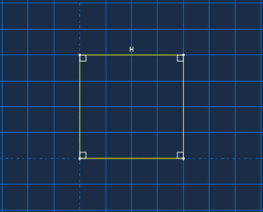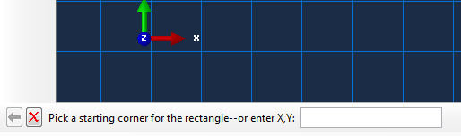

### Module *Property*

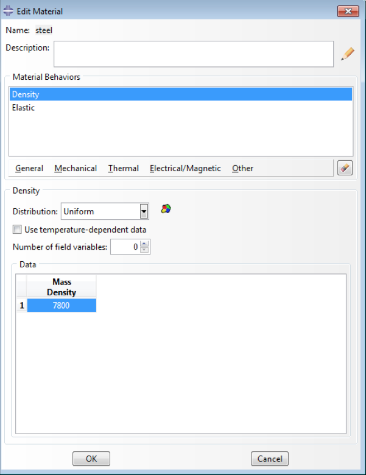
1. In the *Toolbox* area, click the *Create Material* icon . The *Create Material* dialog box appears. We will use the steel ASTM-A36 with the following properties:

    | Material Property & Value | Name |
    |:-:|:-:|
    | $E = 2 \times 10^{11} \,\textrm{Pa}$ | Young's modulus |
    | $\nu = 0.26$ | Poisson's ratio |

    1. Type `ASTM-A36 steel` as the `Name`.
    2. Select `Mechanical > Elasticity > Elastic`.
    3. Type `20.E11` in `Young’s Modulus` and `0.26` in `Poisson’s Ratio`.
    4. Select `Isotropic` as `Type`.

    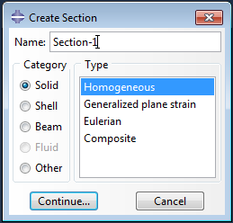
2. In the *Toolbox* area, click the *Create Section* icon 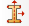. The *Create Section* dialog box appears. In the *Create Section* dialog box:
    1. Name the section `BeamSection`.
    2. In the `Category` list, select `Solid`.
    3. In the `Type` list, select `Homogeneous`.
    4. Click `Continue`.
    
3. The *Edit Section* dialog box appears.  In the *Edit Section* dialog box:
    1. Accept the default selection of `steel` for the `Material` associated with the section. (If you had defined other materials, you could utilize the arrow beside the `Material` text box to select a material of your choice.)
    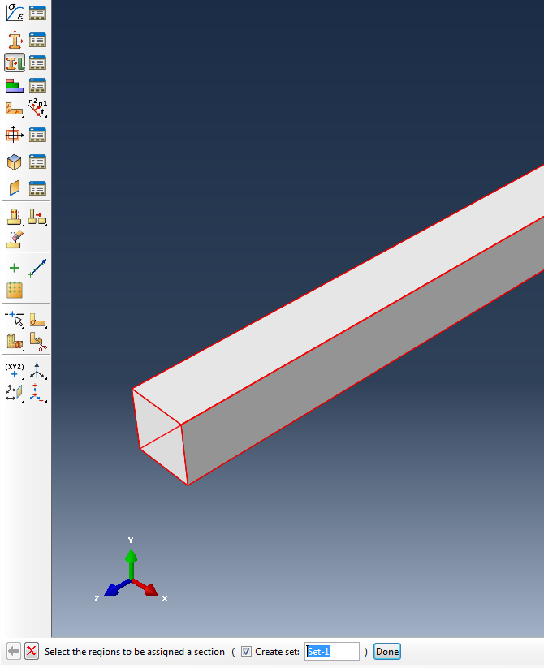
4. In the *Toolbox* area, click the *Assign Section* icon . The *Assign Section* dialog box appears.
    1. Select the entire part as the region (the edge will turn red as show in picture) to which the section will be applied. Abaqus/CAE highlights the entire frame.
    2. Accept the default selection of beam section, and click `OK`.

### Module *Assembly*

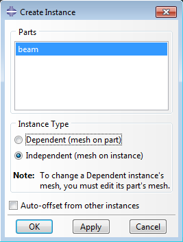
ABAQUS/CAE switches to the *Assembly* module.

1. Click the *Create Instance* icon 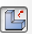. The *Create Instance* dialog box appears.
    1. In the dialog box choose `Parts: beam`.

2. Choose `Independent` in `Instance Type`.  This option affects the meshing dependence:  `Dependent` means that the mesh depends on the part, whereas `Independent` makes the mesh depend on the created instance.

### Module *Part*

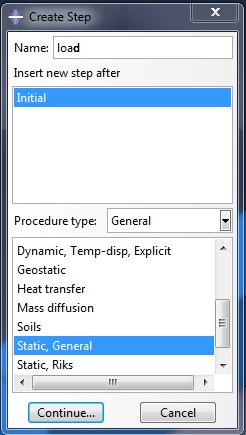
1. Click the *Create Step* icon 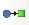. The *Create Step* dialog box appears. 
2. Name the step `Load`.
3. Insert a new step after `Initial` of procedure type `General`; specifically, `Static, General`.
5. The *Edit Step* dialog box appears; click `OK` to dismiss it.

<blockquote>**Note**:  The *Initial* step is the default original step in Abaqus.  Typically a fixed boundary condition is applied in this step, which we will perform in the next section.</blockquote>

### Module *Load*

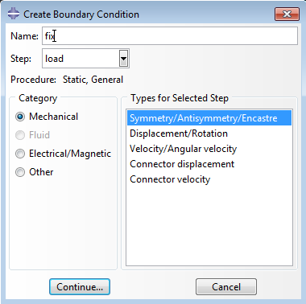
Abaqus/CAE switches to the *Load* module.

1. Click the *Create Boundary Condition* icon 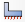. The *Create Boundary Condition* dialog box appears.
    1. Name the boundary condition `Fix`.
    2. From the list of steps, select `Initial` as the step in which the boundary condition will be activated. 
        <blockquote>**Note**:  All mechanical boundary conditions specified in the `Initial` step must have zero magnitudes, a condition automatically enforced by Abaqus/CAE.</blockquote>
    3. In the `Category` list, accept `Mechanical` as the default category selection.
    4. In the `Types for Selected Step` list, select `Symmetry/Antisymmetry/Encastre`, and click `Continue`.
    
    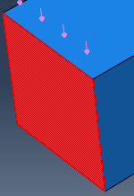

2. In the *Viewport*, select one end surface of the beam as the region to which the boundary condition will be applied. (The surface will turn red.)

3. Click `Done` in the *Prompt* area to indicate that you have finished selecting regions.

    

4. The *Edit Boundary Condition* dialog box appears.
    
    <blockquote>**Note**:  When you define a boundary condition in the initial step, all available degrees of freedom are unconstrained by default.</blockquote>
    1. Toggle on `ENCASTRE`.
    2. Click `OK` to create the boundary condition and to close the dialog box.
    
    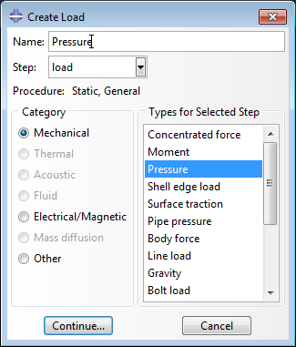

5. Click the *Create Load* icon 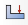.  The *Create Load* dialog box appears.
    1. Name the load `Pressure`.
    2. From the list of steps, select `Load` as the step in which the load will be applied.
    3. In the `Category` list, accept `Mechanical` as the default category selection.
    4. In the `Types for Selected Step` list, accept `Pressure`.
    5. Click `Continue`.
    6. In the *Viewport*, select the top surface of the beam as the region where the load will be applied (again, it will be highlighted in red).
    7. Click `Done` in the prompt area to indicate that you have finished selecting regions.
    
    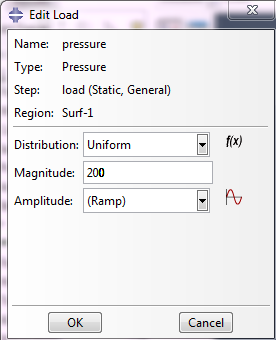

6. The *Edit Load* dialog box appears.
    1. Enter a magnitude of `200.0`.
        
        <blockquote>**Note**:  a positive direction for pressure points toward the surface.</blockquote>
    2. Click `OK` to create the load and to close the dialog box.
    
In the *Viewport*, you can see that Abaqus/CAE displays a downward-pointing arrow to indicate that the load is applied in the negative 2-direction, or $y$ axis.

### Module *Mesh*

Abaqus/CAE switches to the *Mesh* module.

1. Select *Assign Element Type* .
2. In the *Viewport*, drag the mouse to create a box that selects the entire beam as the region to be assigned an element type.  (The edge will be highlighted in red).
3. In the *Prompt* area, click `Done` when you are finished.
4. The *Element Type* dialog box appears.  Use these settings:
    1. `Standard` as the `Element Library` selection (the default).
    2. `Linear` as the `Geometric Order` (the default).
    3. `3D Stress` as the `Family `of elements.
    4. Click `OK` to assign the element type and to close the dialog box.

5. To seed and mesh the model:
    1. Select *Seed Parts Instance* 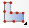.
        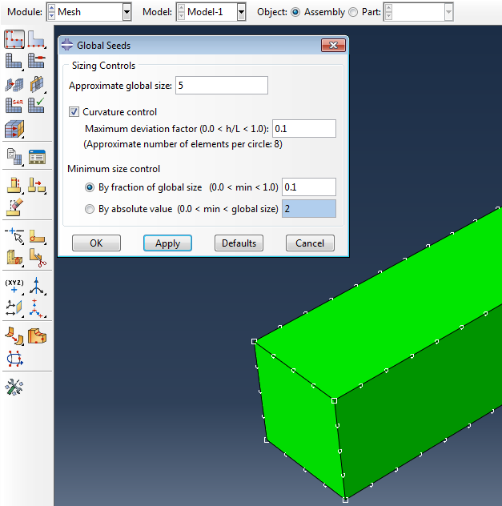
        The *Global Seeds* dialog box appears.  This dialog box displays the default element size that Abaqus/CAE will use to seed the part instance.  This default element size is based on the size of the part instance.  A relatively large seed value will be used so that only one element will be created per region.
        1. Specify an approximate global element size of `5.0`.
        2. Click `OK` to create the seeds and to close the dialog box.
    3. Select *Mesh Part Instance* 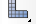.

6. In the *Prompt* area, click `Yes` to confirm that you want to mesh the part instance.
    
    Observe the results.
    
    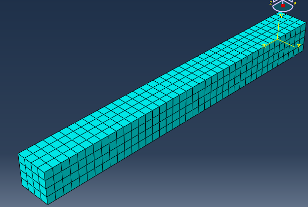

### Module *Job*

Abaqus/CAE switches to the *Job* module.

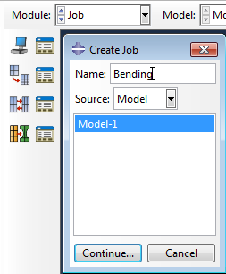

1. Select *Create Job* 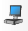.  The *Create Job* dialog box appears with a list of the models in the model database.
    
    When you are finished defining your job, the Jobs container will display a list of your jobs.
    1. Name the job `Bending`, and click `Continue`.

2. The *Edit Job* dialog box appears.
    1. In the `Description` field, type `Beam bending under pressure load`.
    2. Click `OK `to accept default job settings and to close the dialog box.

3. In the *toolbar*, *Save* 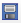 the model as a `.cae` file.

4. Select *Job Manager*  and `Submit` it.

    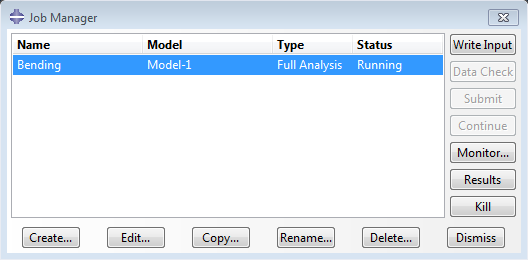

### Module *Visualization*

After completion of the calculation, Abaqus/CAE switches to the *Visualization* module.  You can also enter the *Visualization* module by selecting `Visualization` from the *Module* list located in the *context bar*; or, in the *Job Manager* dialog box, select `Result`.

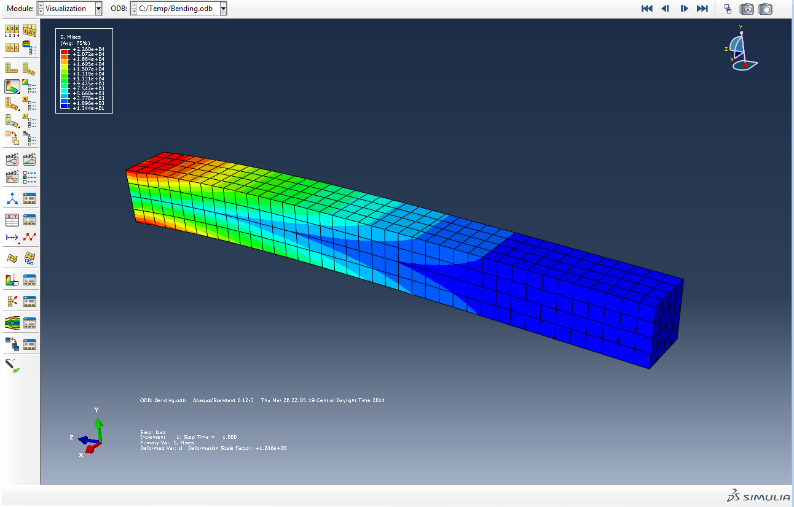

---

## Exercise 1.2:  Postprocessing & Visualization

There are many, many ways to extract desired information out of a simulation.  Let's follow through a few of them directly and see what data we can access.

### 1. View Manipulation & Options 
                   
In the *Toolbar*, there is a *View Manipulation* menu.

In the *Viewport*, there is a *View* compass.

### 2. Render style

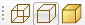

### 3. Display Group

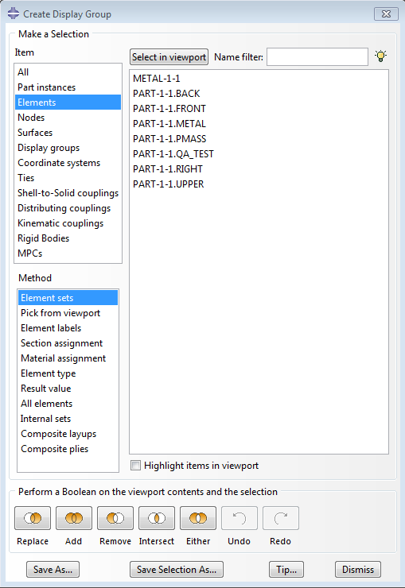
A _display group_ is a collection of viewable objects allowing you to visualize data along certain surfaces or nodes or within certain volumes.

To create a display group:

1. Select particular items of interest.
2. Perform a Boolean operation from the toolbar on your selection and the contents of the current viewport.
    
    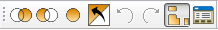

### 4. Field Output Visualization

#### Viewing models each step
- Click on one of the two icons in the first row of the toolbar area 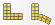.  (You can choose the step at which to view the model by selecting `Result→Step/Frame` from the *Main Menu*.)
    
    <blockquote>**Tips**:  Click `Apply` in each options dialog box to implement your changes in the *Viewport*.  The shape of your deformed model is based on the values of the particular deformed field output variable that you select. Locate the options that control the deformed field output variable.</blockquote>
    
    From the *Main Menu*, select `Result→Field Output`.  Click the `Deformed Variable` tab in the dialog box that appears.

#### Viewing Both
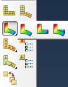

- To combine undeformed and deformed model shapes into a single plot, select `Plot→Contours, Symbols, or Material Orientations→On Both Shapes` from the *Main Menu*.  Alternatively,use the , , and  tools in the *Toolbox* area by clicking and holding on the icon for a moment.

- To superimpose the undeformed and deformed shapes without contours, symbols, or material orientations or to display any combination of plot types for the same results, use the *Allow multiple plot state* tool 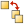 and select all of the desired plot types from the *Toolbox*.

#### Contours
- Locate the options that control the primary field output variable. From the *Main Menu*, select `Result→Field Output`.  Click the `Primary Variable` tab in the dialog box that appears. 

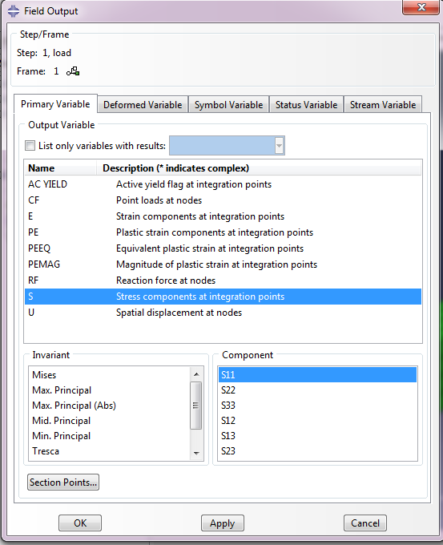

#### Symbol Plot
- Use the *Field Output* dialog box to specify the variable you want to plot.  When you select a symbol variable from the toolbar, the *Visualization* module automatically switches the display to plot symbols on the deformed model shape.
    
    To create a symbol plot of nodal displacement:
    1. From the list of variable types on the left side of the *Field Output* dialog box, select `symbol variable`.
    2. From the list of output variables in the center of the *Toolbar*, select `U (spatial displacement at nodes)`.

#### Customize 
- To customize the appearance of the undeformed shape, use the toolbar area icons to affect the display.
    
    <blockquote>**Tips**:  You can also customize the deformed plot shape using the 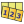 tool in the *Toolbox*. To customize the similar options for the undeformed shape, select `Options→Common` or use the 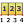 tool in the *Toolbox*.</blockquote>
    
    *To customize the viewport:*
    1. Locate the *State Block* options. From the *Main Menu*, select `Viewport→Viewport Annotation Options→State Block`.
    2. Set up the *Legend*.  `Viewport→Viewport Annotation Options→Legend`.

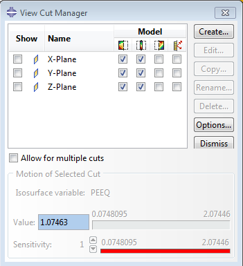

#### Cutting Through A Model
- From the toolbox bar, select View Cut . The *View Cut Manager* appears with a list of all the view cuts that have been created during the current session. A check mark appears in the *Show* column to the left of the active view cut. 
    1. Click the check boxes in the Model columns to the right of the view cut to display the model below 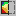, on , and/or above 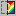 the cut (these positions are not mutually exclusive). The selected portion of the model is displayed in the *Viewport*.

    2. To create a view cut, select `Create`. The *Create Cut* dialog box appears. Click the arrow next to the `Shape` text field, and select a shape from the list that appears: `Plane`, `Cylinder`, `Sphere`, or `Isosurface`.

    3. To display the resultant force and moment along that view cut (acting on the visible component), click the check box under the *Freebody cut* icon in the *Model* columns for the active view cut.

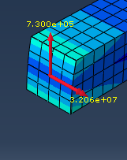

---

## Credits

Neal Davis, Ruizhi Li, and Binyue Hou developed these materials for [Computational Science and Engineering](http://cse.illinois.edu/) at the University of Illinois at Urbana–Champaign.

This content is available under a [Creative Commons Attribution-NonCommercial 4.0 Unported License](https://creativecommons.org/licenses/by-nc/4.0/).

