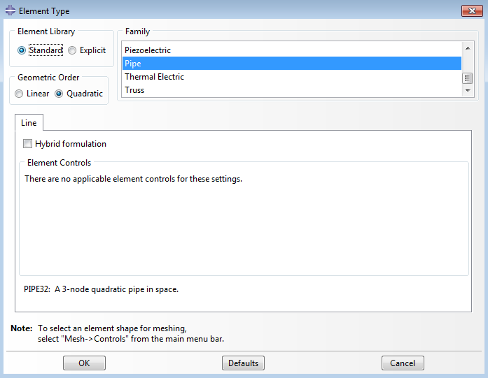
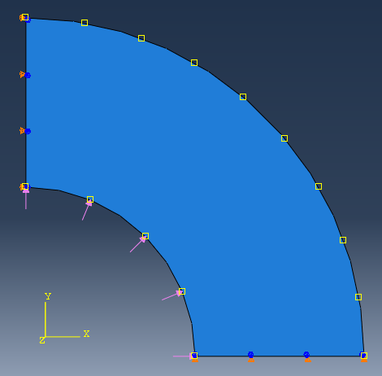

# Abaqus:  A Short Course for Engineers
## 2. Load & Analysis
##### April 2, 2015 • Computational Science and Engineering

## Contents
- [Exercise 2.1:  Vibration of a Pipe](#ex-1)
    - [Module *Part*](#ex-1-parts)
    - [Module *Property*](#ex-1-property)
    - [Module *Assembly*](#ex-1-assembly)
    - [Module *Step*](#ex-1-step)
    - [Module *Load*](#ex-1-load)
    - [Module *Mesh*](#ex-1-mesh)
    - [Module *Job*](#ex-1-job)
    - [Module *Visualization*](#ex-1-vis)
- [Exercise 2.2:  Vibration of a Pipe Redux](#ex-2)
    - [Restart Analysis](#ex-2-restart)
    - [Postprocessing](#ex-2-post)
- [Exercise 2.3:  Thermal Gradient and Pressure on Spherical Tank](#ex-3)
    - [Modeling](#ex-3-modeling)
    - [Predefined Conditions](#ex-3-conds)
    - [Meshing](#ex-3-meshing)
    - [Job & Postprocessing](#ex-3-post)
- [Reference](#refs)
- [Credits](#credits)

---

## Exercise 2.1:  Vibration of a Pipe

We will study the vibrational frequencies of a $5 \,\textrm{m}$ section of pipe.  The pipe is clamped firmly at one end and can move only axially at the other end.  We will use three-dimensional beam elements to model the pipe section.

When unloaded, the lowest vibrational mode of the pipe is $40.1 \,\textrm{Hz}$.
However, loading may affect the response.
Resonance is highly undesirable in this system, so we require the magnitude of the in-service load such that the pipe's lowest vibrational mode is higher than $50 \,\textrm{Hz}$.
It is intended that this section of pipe be subject to axial tension in service; we should therefore consider various loads, starting with a load magnitude of $4 \,\textrm{MN}$.

### Module *Part*
You should now create a `3D`, `deformable`, `planar` `wire` part (using a scale just larger than the largest dimension of your model).  Name this part `Pipe`.  Select the *Create Lines: Connected* tool and sketch a horizontal line of length `5.0 m`.  (This time, use the icon on the *Model* tree.)

### Module *Property*

We will utilize a steel similar to that of the first exercise (the loaded beam):

| Material Property & Value | Name |
|:-:|:-:|
| $E = 2 \times 10^{11} \,\textrm{Pa}$ | Young's modulus |
| $\nu = 0.3$ | Poisson's ratio |
| $\rho = 7800 \,\textrm{kg·m}^{-3}$ | density |

1. Create a steel `Steel` with the foregoing properties.  To edit the density, select `Edit Material -> General -> Density`.

2. Create a Pipe profile from the main menu bar (`Profile`) or from the toolbar box .  Name the profile `PipeProfile`, and specify the shape as `Pipe`.
    
    In the *Edit Profile* dialog box, choose `Thin-walled type`, and specify an outer radius of $0.18 \,\textrm{m} \div 2 = 0.09 \,\textrm{m}$ and a wall thickness of $0.02 \,\textrm{m}$ for the pipe.
    
    <blockquote>**Note**: Profile definition is necessary here, since we used only a simple line to represent the pipe.</blockquote>
    

3. Create a section named `PipeSection` of category `Beam` and type `Beam`.
    In the *Edit Beam Section* dialog box, we must specify that section integration will be performed during analysis and assign material `Steel` and profile `PipeProfile` to the section definition.
    
    <blockquote>**Note**: The setting "during analysis" is used when section properties must be recomputed as the beam deforms.</blockquote>
    <blockquote>**Note**: The option `Section Poisson’s ratio` provides uniform strain in the section due to the strain of the beam axis so that the cross-sectional area changes when the beam is stretched.</blockquote>
        

4. Assign section `PipeSection` to the pipe. 

5. Click `Assign Beam Orientation`  and use the default direction of $(0,0,-1)$.

### Module *Assembly*

1. Create a dependent instance of the part named `Pipe`. 

2. Create geometry sets.
    <blockquote>**Note**:  In Abaqus, you can define different types of sets, such as geometry, load, boundary condition; this allows you to edit parts by group rather than individually when necessary.</blockquote>

3. In the model tree go to `Model-1→Assembly` and double-click on `Sets`. Or in the menu bar go to `Tools→Set→Create`.

4. In the *Create Set* dialog box, name the `Set` as `LeftEnd` and `Continue` to select the left end of the pipe; click `Done` in the *Prompt Area*.  A new set named `Left` in the *Sets tree* appears.  Create another set named `RightEnd` containing the right end of the pipe.

### Module *Step*

Two steps are required:

| Step | Details |
|:-|:-|
| General             | Apply a 4 MN tensile force.      |
| Linear perturbation | Calculate modes and frequencies. |

1. Create a step of the type `General; Static, General`.
    1. Name this step `Pull I` with the following description:  `Apply axial tensile load of 4.0 MN.`
    2. In the *Edit Step* dialog box, include the effects of geometric nonlinearity by toggling on `Nlgeom`.  Specify `Time period` of `1` and `Incrementation→Initial increment size` of `0.1`.
        <blockquote>Time has no physical meaning in a static analysis procedure, but this causes Abaqus/Standard to apply 10% of the load in the first increment.  We just need it load relatively fast.</blockquote>

2. Create another step of the type `Linear perturbation, frequency`.
    1. Name the step `Frequency I`, and give it the following description:  `Extract modes and frequencies; extract the first 8 eigenmodes for the model.`
    2. In the *Edit Step* dialog box, choose `Eigensolver: Subspace`, request `8` eigenvalues, use `16` vectors per iteration and limit the maximum number of iterations to `30`. 

3. The final default step is `Output requests`.  In this case, the default output database output requests created by Abaqus/CAE for each step will suffice and we do not need to create any additional output database output requests.
    But if you do need to request output to the restart file:
    1. In the *Main Menu*, select `Output→Restart Requests` from the *Main Menubar* of the *Step* module.
    2. For the step labeled `Pull I`, write data to the restart file `Every 10 increments`.
    3. For the step labeled `Frequency I`, write data to the restart file `Every 1 increment`.

### Module *Load*

1. In the first step `Pull I`, create a `Mechanical Concentrated force` named `Force` that applies a `4E6` $\textrm{N}$ tensile force to the `RightEnd` set.  This will cause it to deform in the positive axial (global 1) direction.  
    (Adjust these steps in the context bar, or in the model tree, go to  `Steps→Pull I→BCs/Loads`.)
    (Now you can use the sets we just created, can click the right end in the viewport, or select from the *Sets* list in the prompt area)
              

The pipe section is clamped at its left end (`Encastre`). It is also clamped at the right end; however, the axial force must be applied at this end, so only degrees of freedom 2 through 6 (`U2`, `U3`, `UR1`, `UR2`, and `UR3`) are constrained. 
<blockquote>**Note**:  All loads and boundary conditions are applied in the first step.</blockquote>

### Module *Mesh*

1. Seed and mesh the pipe section with `30` uniformly spaced `Quadratic` pipe elements (`PIPE32`).
    1. 5m , 30 elements, I need a calculator! Go to the command line .
    2. For a 2D model, you don’t need to assign mesh control.

2. Before continuing, rename the model to `Original` (at the *Model tree*).

3. Create a job named `Pipe` with the description `Analysis of a 5 meter long pipe under tensile load`.

4. Save your model in a model database file, and submit the job for analysis.

### Module *Job*

You can open the *Job Monitor* in the *Job Manager* dialog box. Here you can see the *Log*, *Errors*, *Warnings* and other output of the `Pipe` job.

1. Open the folder where your job is running. We can see these files: 
        Pipe.log:
        Pipe.dat:
        Pipe.msg:
        Pipe.odb:
        Pipe.inp
        Pipe.res
        …

### Module *Postprocessing*

1. Enter the *Visualization* module, and open the output database file, Pipe.odb, created by this job.
2. To plot the first mode shape:
    1. From the *Main Menu*, select `Result→Step/Frame`.
    2. In the *Step/Frame* dialog box, select step `Frequency I` and frame `Mode 1`.
    3. Click `OK`.

---

## Exercise 2.2:  Vibration of a Pipe Redux

The first simulation predicted that the piping section _would_ be vulnerable to resonance when extended axially.  We must now determine how much _additional_ axial load will increase the pipe's lowest vibrational frequency to an acceptable level.

We will conduct this analysis by _restarting_ the previous analysis of the vibration.

### Restart Analysis

TODO: reword

1. Copy the model named `Original` to a model named `Restart`.  (Go to the *Model Manager* from the *Main Menu*, or right click on `Original` at the model tree)
        

2. Set the model attributes.
    To perform a restart analysis, the model's attributes must be changed to indicate that the model should reuse data from a previous analysis.
    1. In the *Model Tree*, double-click the `Restart` model underneath the *Models container*.
    2. The *Edit Model Attributes* dialog box that appears, specify that restart data will be read from the job `Pipe` and that the restart location will be the end of step `Frequency I`. 
                

3. Create two new analysis steps.
    1. The first new step is a general static step.
        1. Name the step `Pull II`, and insert it immediately after the step `Frequency I`.
        2. Give the description `Apply axial tensile load of 8.0 MN` to the step.
        3. Set the `time period` for the step to `1.0` and the `initial time increment` to `0.1`. 
    2. The second new step is a frequency extraction step.
        1. Name the step `Frequency II`.
        2. Insert it immediately after the step `Pull II`.
        3. Give the step the description `Extract modes and frequencies`.
        4. Use the `Lanczos` eigensolver to extract the first `8` natural modes and frequencies of the pipe.
    3. For the step `Pull II`, write data to the restart file `Every 10 increments`.
    4. Accept all other default output data requests.

4. Modify the load definition so that the tensile load that is applied to the pipe is doubled in the second general static step (`Pull II`).  To do this,
    1. Expand the *Force* item underneath the *Loads* container in the *Model Tree*.
    2. In the list that appears, expand the *States* item.
    3. Double-click the step named `Pull II`.
    4. Change the value of the applied force to `8.0E+06` in this step.

5. Create a job named `PipeRestart`.
    1. Add the description `Restart analysis of a 5 meter long pipe under tensile load`.
    2. Set the job type to `Restart` if it is not already. (If the job type is not set to Restart, Abaqus/CAE ignores the model's restart attributes.)

6. Save your model in a model database file, and submit the job for analysis.

### Postprocessing

TODO: reword

#### Plotting the Eigenmodes of the Pipe System
##### Plotting X–Y graphs from field data for selected steps
Use the field data stored in the output database files, `Pipe.odb` and `PipeRestart.odb`, to plot the history of the axial stress in the pipe for the whole simulation.

1. In the *Results Tree*, double-click *XYData* to show the *Create XY Data* dialog box.
    1. Select `ODB field output` from this dialog box, and click Continue to proceed.
    2. In the *XY Data from ODB Field Output* dialog box, select the *Variables* tab.
        1. Accept the default selection of `Integration Point` for variable position.
        2. Select `S11` from the list of available stress components.
        3. Toggle `Select` for the section point.
        4. Click *Settings* to choose a section point.

        3. In the *Field Report Section Point Settings* dialog box:
            1. Select the category `beam` and choose any available section point for the pipe cross-section.

        4. In the *XY Data from ODB Field Output* dialog box, select the *Elements/Nodes* tab.
            1. Select `Element labels` as the selection *Method*.
                
                There are 30 elements in the model, and they are numbered consecutively from 1 to 30. Enter any element number (e.g., `18`) in the *Element labels* field.

        5. Click `Active Steps/Frames`, and select `Pull II` as the only step to extract data from.
        6. At the bottom of the XY Data from ODB Field Output dialog box:
            1. Click Plot to see the history of axial stress in the element.
                
                The resulting plot shows the axial stress history for each integration point of the element during the restart analysis.  Since there is a job history prior to the restart, it is desirable to view the entire analysis.

##### Plotting history of entire analysis
1. Save the current plot by clicking `Save` at the bottom of the *XY Data from ODB Field Output* dialog box. Two curves are saved (one for each integration point), and default names are given to the curves.

2. Rename one curve `RESTART`, and delete the other curve.

3. From the main menu bar, select `File→Open` or use the  tool in the *File toolbar* to open the file `Pipe.odb`.

4. Following the procedure outlined above, save the plot of the axial stress history for the same element and integration/section point used above. Name this plot `ORIGINAL`.

5. In the *Results Tree*, expand the *XYData container*.

6. Select both plots with `[Ctrl]+Click`. Right click to display a *context menu*.  Select `Plot` from this menu to create a plot of axial stress history in the pipe for the entire simulation.

7. To change the style of the line, open the *Curve Options* dialog box.
    1. For the `RESTART` curve, select the dotted line style `— — —`.
    2. Dismiss the dialog box.

8. To change the axis titles, open the *Axis Options* dialog box.  In the *Title* tab:
    1. Change the X-axis title to `TOTAL TIME`.
    2. Change the Y-axis title to `STRESS S11`.
    3. Dismiss the dialog box.

<table>
<tr>
<td>

</td>
<td>

</td>
</tr>
<tr>
<td>
**Figure**.  History of axial stress in the pipe.
</td>
<td>
**Figure**.  History of axial stress in the pipe during Step 3.
</td>
</tr>
</table>

---

## Exercise 2.3:  Thermal Gradient and Pressure on Spherical Tank

We will now calculate factors involved with a spherical steel tank under the effect of both a thermal gradient and pressure due to a contained fluid.

### Modeling

TODO: reword

1. Create a `2D` `deformable` `Shell` part, named `Tank`. The approximate size should be `0.5`. Use the *Create Arc*  and *Connected line*  tools to create a quarter of Spherical Tank. Use *Add Dimension*  to set the inner radius to be 1.E-1; outer radius to be 2.E-1.
          

2. Create a material named `Steel`.
    1. Define the `Elastic property` with $E=$ `210.E9` and $\nu=$ `0.3`.
    2. We need to define more properties for the coupled problem.  Open the *Edit Material* dialog box.
        1. In `Mechanical→Expansion`, define thermal expansion coefficient to be `1.2E-5`.
        2. In `Thermal→Conductivity`, define the thermal conductivity to be `43`.

3. Create the section of this material named `SteelSection` and assign it to the `Tank` part.

### Predefined Conditions

1. First instance the `Tank` part and create a new step named `CouTemp` of type is `General Coupled temp-displacement`. 
    1. In the *Edit Step* dialog box, choose `Response type` `Steady-state` and toggle on `Nlgeom`.

2. Since it is a quarter of the tank, we define symmetry boundary condition at the left and bottom.  From `Initial Step`, at the left boundary fix `U1` and `UR3`; at the bottom boundary fix `U2` and `UR3`.

3. In the step `CouTemp`, we create a temperature boundary along the inner surface of tank. Choose *Create Boundary Condition*.
    1. In this dialog box, select *Category* `Other` and *Types* `Temperature`, naming it `InnerTemp` with *Magnitude* `100`.
    2. Similarly, define an outer surface temperature of `30`.
      
4. The contained fluid also exerts pressure on the inner surface of the tank. Define an `InnerPressure` of `30E5` along the inner surface. (Consult the figure below.)

### Meshing

1. Use the *Seed edges*  tool to seed the inner and outer edge with `30` elements.
2. Seed the left and bottom edge with `10` elements.
3. For the elements, choose the `Standard` element library in the `Coupled Temperature-Displacement` family with a `Quadratic` order `Reduced integration (CPE8RT)` method.  Use `Quad/Structured` to mesh the part. 

### Job & Postprocessing

1. Create a job, save it, and run it.
2. Observe the resulting temperature distribution and stress distribution with *Field Output*.

---

## References

This tutorial is based on two examples from the [Abaqus 6.12 documentation](http://www.material.physik.uni-goettingen.de/abaqus/v6.12/books/gsa/ch11s03.html).

---

## Credits

Neal Davis, Ruizhi Li, and Binyue Hou developed these materials for [Computational Science and Engineering](http://cse.illinois.edu/) at the University of Illinois at Urbana–Champaign.

This content is available under a [Creative Commons Attribution-NonCommercial 4.0 Unported License](https://creativecommons.org/licenses/by-nc/4.0/).  The original tutorial upon which these materials were based is [© 2012 Dassault Systémes](http://www.material.physik.uni-goettingen.de/abaqus/v6.12/books/popups/usb-lgl.html).

